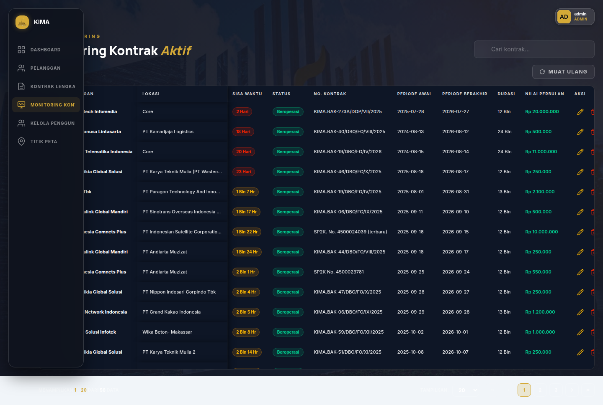
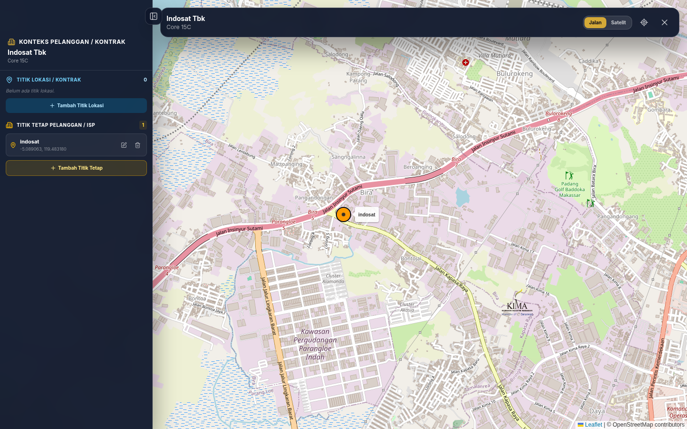

# User Manual Sistem FO KIMA

## Tujuan

Panduan ini menjelaskan penggunaan harian Sistem FO KIMA untuk mengelola pelanggan, kontrak, dokumen Google Drive, titik peta, pengguna, dan portal ISP. Dokumen ini bukan laporan UAT dan bukan panduan instalasi.

## 1. Akses dan role

1. Buka URL aplikasi yang diberikan administrator.
2. Masukkan email dan password, lalu klik **Masuk**.
3. Jika login berhasil, sistem membuka halaman sesuai hak akses akun.

| Role | Akses utama |
|---|---|
| Admin | Dashboard, Pelanggan, Kontrak Lengkap, Monitoring Kontrak, Kelola Pengguna, dan Titik Peta. |
| Teknisi | Titik Peta. |
| ISP | Mengikuti penugasan pelanggan yang telah diaktifkan administrator. |

> Jangan membagikan password atau token sesi. Hubungi administrator jika akun nonaktif atau lupa password.

## 2. Dashboard (Admin)

Dashboard merangkum jumlah pelanggan, kontrak aktif, kapasitas Core, tren, dan status kontrak.

1. Pilih menu **Dashboard**.
2. Gunakan filter/periode bila tersedia untuk melihat ringkasan yang relevan.
3. Pada kartu **Core Tersewa**, klik **Rincian** untuk melihat pemakaian Direct Core serta Sharing Core per pelanggan.

## 3. Kelola pelanggan (Admin)

### Tambah pelanggan

1. Buka menu **Pelanggan** lalu klik **Tambah Pelanggan**.
2. Isi minimal **Nama Pelanggan**. Isi PIC, telepon, email, dan keterangan bila tersedia.
3. Periksa kode pelanggan yang dibuat sistem, lalu klik **Simpan/Tambah Pelanggan**.
4. Gunakan pencarian pada tabel untuk memastikan pelanggan tersimpan.

### Edit atau hapus pelanggan

- Gunakan ikon **Edit** pada baris pelanggan untuk mengubah data.
- Gunakan ikon **Hapus** hanya jika pelanggan tidak lagi memiliki kontrak yang perlu dipertahankan.
- Konfirmasi nama pelanggan pada dialog sebelum menghapus.

## 4. Kelola kontrak (Admin)

### Tambah kontrak

1. Buka **Kontrak Lengkap** lalu klik **Tambah Kontrak**.
2. Pilih pelanggan, isi lokasi, periode awal/akhir, nomor atau kode kontrak, dan nilai kontrak.
3. Pilih salah satu kapasitas: **Direct Core** atau **Sharing Core**. Jangan isi keduanya bersamaan.
4. Isi biaya aktivasi, biaya per bulan, dan nilai periode aktif jika digunakan.
5. Opsional: unggah dokumen dan pilih kategori **Kontrak**, **BAK-PKS**, atau **Dokumen Lain**.
6. Klik **Simpan** dan pastikan baris kontrak muncul pada tabel.

### Edit kontrak

Gunakan aksi **Edit Kontrak** pada baris yang sesuai. Periksa pelanggan, lokasi, periode, kapasitas, serta nilai sebelum menyimpan. Gunakan edit kontrak untuk koreksi data pada hari pertama periode.

### Perpanjang kontrak

1. Pada kontrak yang akan diperpanjang, klik **Perpanjang Kontrak**.
2. Isi periode, kode/nomor, durasi, dan nilai kontrak baru.
3. Simpan. Sistem menyimpan kontrak lama sebagai histori berstatus **Diperpanjang** dan membentuk record periode baru.

### Upgrade paket

1. Klik **Upgrade Paket Kontrak** pada kontrak yang aktif.
2. Isi **Tanggal Mulai Upgrade**, kode kontrak baru, kapasitas baru, nilai, dan biaya per bulan.
3. Untuk Sharing Core, pilih mode **Sharing Core** lalu pilih rasio baru, misalnya `1/8`.
4. Klik **Upgrade Paket**.

Aturan penting:

- tanggal upgrade harus **setelah** tanggal mulai kontrak lama;
- kontrak lama diakhiri pada satu hari sebelum tanggal upgrade dan berstatus **Di-upgrade**;
- kontrak baru dimulai pada tanggal upgrade;
- akhir kontrak baru dihitung dari tanggal upgrade ditambah durasi × 30 hari.

## 5. Dokumen dan Google Drive

Dokumen dapat diunggah saat tambah, edit, perpanjang, atau upgrade kontrak.

1. Pilih file pada area unggahan.
2. Pilih kategori dokumen.
3. Simpan transaksi kontrak.
4. Pada detail kontrak, gunakan tombol **Preview** atau **Download** untuk membuka dokumen melalui backend.
5. Untuk menghapus dokumen, pilih aksi hapus pada baris dokumen lalu konfirmasi.

Sistem membuat struktur folder pelanggan → lokasi → periode kontrak → kategori dokumen pada Google Drive. Penghapusan dokumen dari aplikasi juga menghapus file pada Drive.

## 6. Monitoring kontrak (Admin)

1. Buka menu **Monitoring Kontrak**.
2. Gunakan pencarian dan filter status untuk menemukan kontrak.
3. Periksa periode, sisa waktu, status, kapasitas, dan nilai kontrak.
4. Gunakan aksi pada baris kontrak bila perlu melakukan edit, perpanjangan, atau upgrade.

## 7. Titik peta (Admin dan Teknisi)

1. Buka **Titik Peta**.
2. Cari dan pilih pelanggan/lokasi pada tabel untuk membuka peta serta sidebar konteks.
3. Klik **Tambah Titik Lokasi**, tentukan koordinat pada peta, isi label, lalu simpan.
4. Gunakan ikon edit atau hapus pada sidebar untuk mengelola titik lokasi.
5. Untuk titik kantor/ISP, pilih **Tambah Titik Tetap** lalu isi label dan koordinat.

## 8. Kelola pengguna (Admin)

1. Buka **Kelola Pengguna**.
2. Klik **Tambah Pengguna**, isi email, role, dan password sementara.
3. Gunakan **Edit Pengguna** untuk memperbarui data atau role.
4. Gunakan **Nonaktifkan Pengguna** untuk menghentikan akses tanpa menghapus histori audit.

### Menugaskan pelanggan ke akun ISP

1. Buat akun baru dengan role **ISP - Mitra**, atau buka **Edit** pada akun yang
   akan dijadikan ISP.
2. Pastikan field **Role** bernilai **ISP - Mitra**.
3. Pada bagian **Pelanggan yang dapat diakses**, centang satu atau beberapa
   pelanggan.
4. Klik **Simpan**. Assignment menggantikan daftar assignment sebelumnya,
   sehingga pelanggan yang tidak dicentang tidak lagi dapat dilihat akun ISP.
5. Jika tidak ada pelanggan yang dicentang, portal ISP tetap dapat login tetapi
   tidak menampilkan data pelanggan, kontrak, atau dokumen.

### Filter status akun

Gunakan tombol filter di bagian atas tabel **Kelola Pengguna**:

- **Semua:** menampilkan akun aktif dan nonaktif.
- **Aktif saja:** hanya menampilkan akun yang dapat login.
- **Nonaktif saja:** hanya menampilkan akun yang sudah dinonaktifkan.

Filter status dapat digunakan bersamaan dengan kolom pencarian email.

Admin aktif terakhir tidak dapat dinonaktifkan. Jika password direset, pengguna harus login ulang.

## 9. Portal ISP

Akun ISP hanya dapat melihat pelanggan yang ditugaskan Admin. Setelah login,
ISP memiliki tiga halaman utama:

1. **Ringkasan** — profil pelanggan yang ditugaskan dan jumlah kontraknya.
2. **Kontrak & Lokasi** — kontrak/lokasi yang dimiliki pelanggan tersebut.
3. **Dokumen** — daftar dokumen pelanggan/kontrak dengan tombol **Preview** dan **Download**.

ISP juga dapat mengunggah dokumen ke pelanggan atau kontrak yang ditugaskan.
Dokumen dibuka melalui backend setelah sesi dan penugasan pelanggan diverifikasi;
tautan atau ID Google Drive tidak ditampilkan di portal ISP. Akses ke pelanggan
lain ditolak oleh backend meskipun ID pelanggan diubah secara manual.

## 10. Penyelesaian masalah singkat

| Kondisi | Tindakan |
|---|---|
| Login ditolak | Periksa email/password atau hubungi administrator untuk status akun. |
| Data tidak tampil | Muat ulang halaman, periksa filter/pencarian, lalu pastikan role memiliki akses. |
| Pelanggan tidak muncul pada akun ISP | Pastikan Admin sudah memilih pelanggan pada **Edit Pengguna → Pelanggan yang dapat diakses**, lalu logout/login ulang. |
| Filter akun tidak berubah | Pastikan tombol **Semua**, **Aktif saja**, atau **Nonaktif saja** sudah dipilih; muat ulang tabel bila perlu. |
| Upload gagal | Periksa koneksi, ukuran/format file, kategori, dan konfigurasi Google Drive. |
| Upgrade ditolak | Pastikan tanggal upgrade setelah tanggal mulai kontrak; gunakan Edit Kontrak untuk koreksi hari pertama. |
| Folder Drive tidak terbuka | Pastikan tautan dibuka dengan akun/izin yang sesuai, lalu laporkan ke administrator. |

## 11. Penutup

Selalu periksa data sebelum menyimpan atau menghapus. Untuk perubahan yang berdampak pada kontrak aktif, lakukan sesuai prosedur bisnis dan simpan dokumen pendukung pada kategori yang tepat.
