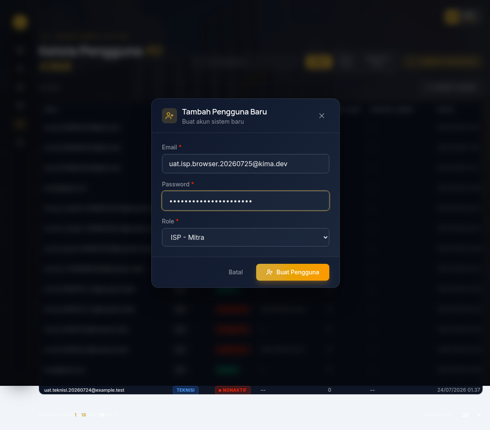
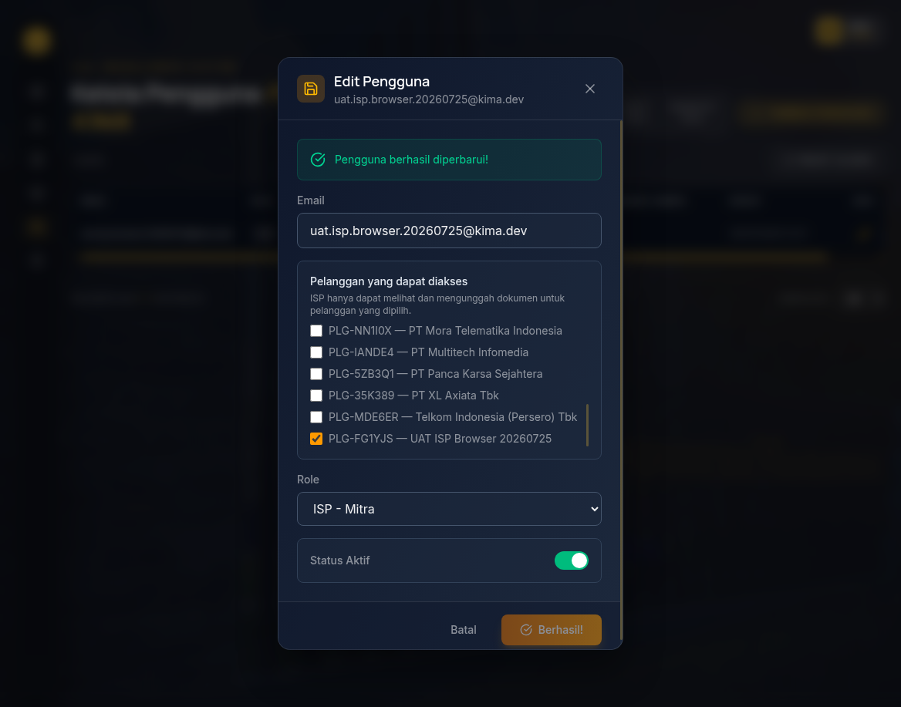
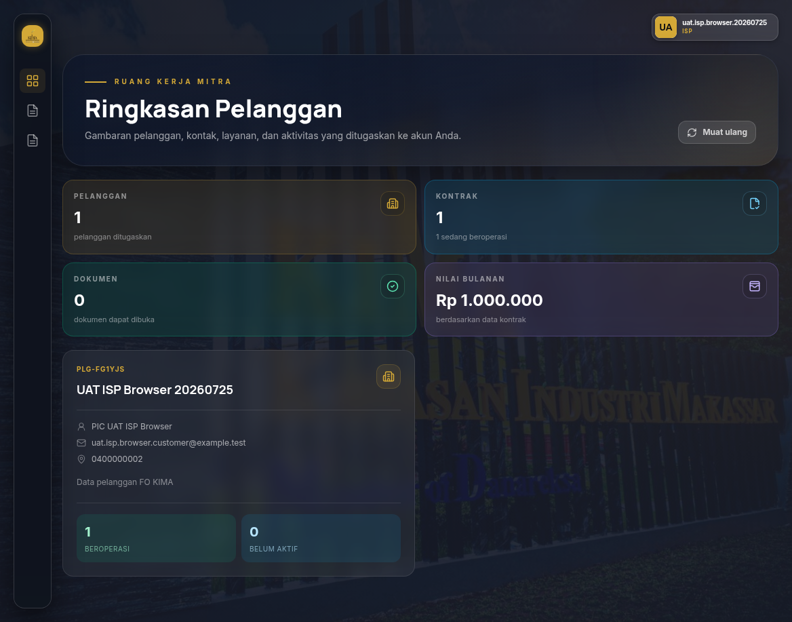
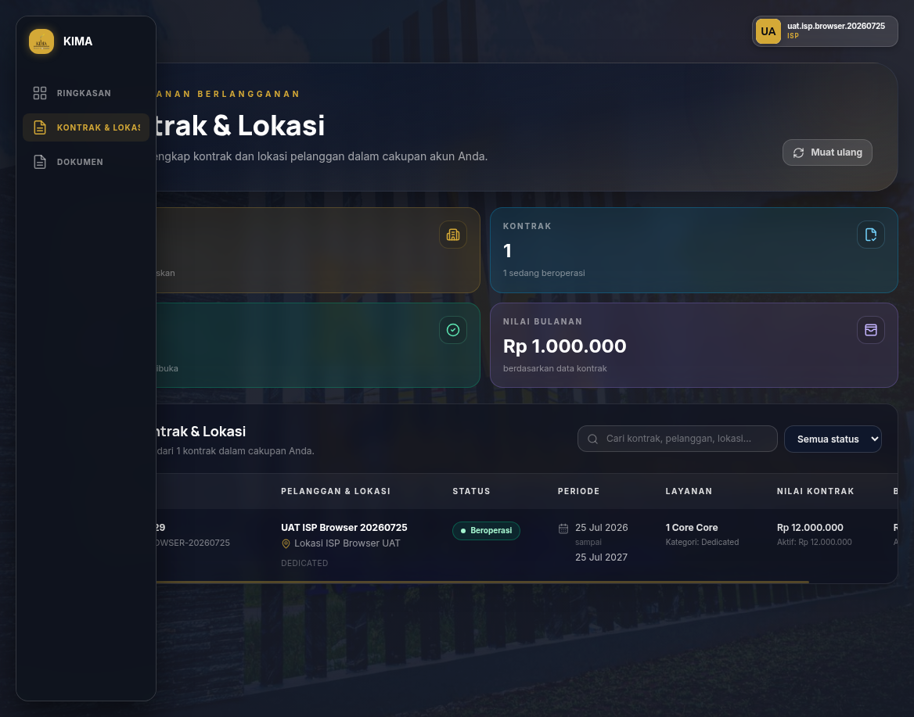
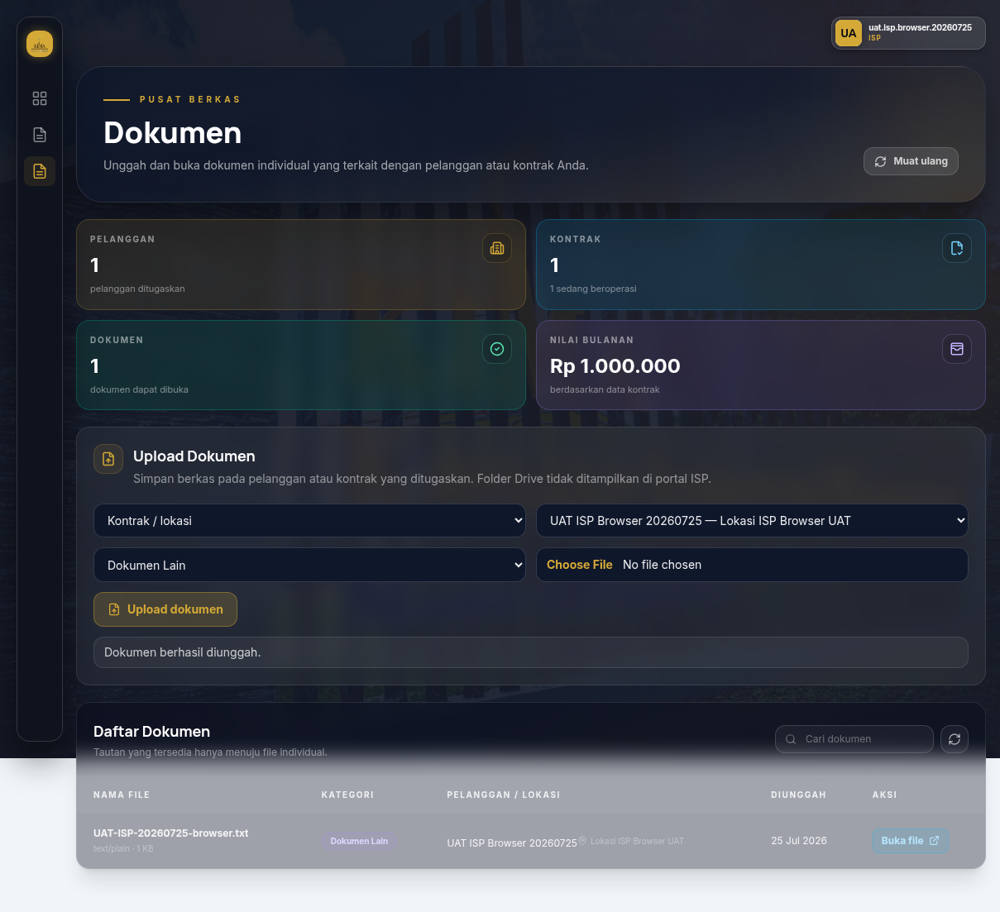
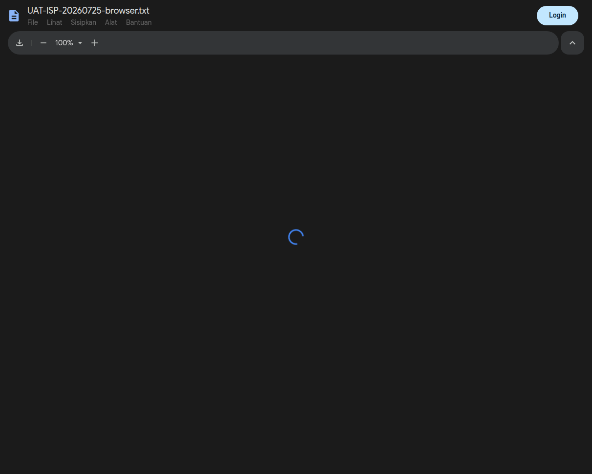
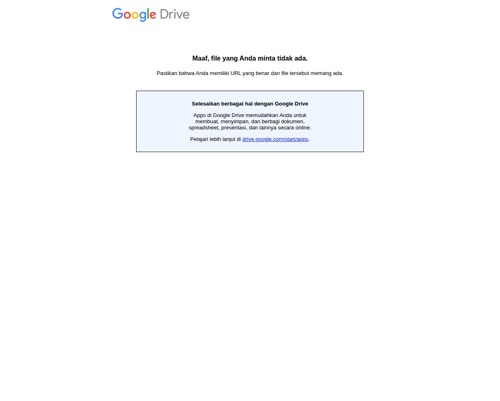

# Laporan UAT Role ISP — 25 Juli 2026

## Ringkasan

UAT backend end-to-end berhasil pada dataset sementara `UAT-ISP-20260725-R2`:
13 skenario lulus dan 0 gagal. Dataset pelanggan, kontrak, dokumen, penugasan,
dan folder Drive sudah dibersihkan setelah pengujian.

Pengujian komplit berikutnya menambahkan multi-penugasan dan penonaktifan akun:
14 skenario lulus dan 0 gagal.

Eksekusi awal sempat menemukan field folder pada respons upload ISP. Perbaikan
diterapkan, kemudian seluruh skenario diulang dan lulus.

## Environment

- Backend build terbaru dijalankan sementara pada `127.0.0.1:18080`.
- Database terhubung dan readiness berhasil.
- Database memiliki 1 akun ISP aktif sebelum setup UAT.
- Tidak ada dokumen tersimpan saat pengujian.

## Eksekusi backend terbaru — UAT-ISP-20260725-521796

UAT backend dijalankan ulang dengan data sementara melalui API Admin dan akun
ISP baru. Skenario meliputi pembuatan akun ISP, pembuatan dua pelanggan
pembanding, pembuatan kontrak/lokasi, penugasan pelanggan, login ISP, filter
data, pembatasan endpoint admin, upload dokumen yang diizinkan, dan penolakan
upload lintas pelanggan.

| Ringkasan | Hasil |
|---|---:|
| Skenario backend | **18 lulus, 0 gagal** |
| Cleanup dokumen, kontrak, dan pelanggan | **Lulus** |
| Akun ISP UAT setelah pengujian | **Dinonaktifkan** |
| Sisa data UAT terverifikasi di database | **0** |

Semua respons ISP tidak mengekspos `link_folder_berkas` atau
`drive_folder_id`. Endpoint `/api/dashboard`, `/api/users`, dan
`/api/titik-peta` ditolak dengan HTTP 403. Upload ke pelanggan yang ditugaskan
berhasil, sedangkan upload lintas pelanggan ditolak HTTP 403 tanpa membuat
metadata atau file baru.

Percobaan setup awal menggunakan nilai Core mentah `1` ditolak oleh constraint
database `chk_lokasi_core_format`; pengujian diulang dengan format data yang
sesuai aplikasi, yaitu `1 Core`, dan seluruh skenario lulus. Form frontend
memang menyediakan format `1 Core`.

## Temuan UAT terbaru

| ID | Severity | Status | Temuan | Rekomendasi |
|---|---|---|---|---|
| UAT-ISP-20260725-01 | Sedang | Terbuka sebagai catatan teknis | API pembuatan kontrak dengan input Core mentah `1` menghasilkan HTTP 500 karena constraint `chk_lokasi_core_format`, bukan respons validasi HTTP 400. Nilai UI yang benar, `1 Core`, berhasil diproses. | Tambahkan validasi/normalisasi Core di backend agar input tidak valid ditolak sebagai HTTP 400 dengan pesan yang jelas. |

Temuan ini tidak memengaruhi alur normal melalui UI karena form frontend
mengirim nilai dengan format `1 Core`. Seluruh skenario akses, pembatasan data,
upload, dan cleanup role ISP tetap lulus.

## Hasil Eksekusi Awal (sebelum retest)

Tabel berikut mencatat percobaan awal yang menemukan field folder pada respons
upload. Hasil final setelah perbaikan ada pada bagian retest di bawahnya.

| ID | Hasil | Bukti/observasi |
|---|---|---|
| ISP-01 | Tertunda | Pembuatan akun tidak dijalankan agar tidak menulis database live. |
| ISP-02 | Tertunda | Akun ISP aktif belum diberi pelanggan; penugasan tidak dibuat pada live DB. |
| ISP-03 | Tertunda | Password akun ISP tidak tersedia untuk login browser. |
| ISP-04 | Lulus | Token UAT akun ISP tanpa penugasan: pelanggan, kontrak, dan dokumen mengembalikan daftar kosong. |
| ISP-05 | Tertunda | Tidak ada pelanggan yang ditugaskan untuk ditampilkan. |
| ISP-06 | Tertunda | Tidak ada kontrak dalam cakupan akun ISP. |
| ISP-07 | Tertunda | Tidak ada dokumen dalam cakupan akun ISP. |
| ISP-08 | Tertunda | Tidak ada file UAT. |
| ISP-09 | Tertunda | Upload sukses memerlukan kontrak yang ditugaskan dan Google Drive UAT. |
| ISP-10 | Tertunda | Upload sukses memerlukan pelanggan yang ditugaskan. |
| ISP-11 | Lulus | Upload ke lokasi milik pelanggan lain mengembalikan HTTP 403; jumlah dokumen sebelum/sesudah tetap 0. |
| ISP-12 | Lulus sebagian | Filter akun tanpa penugasan menghasilkan data kosong; pengujian ID lintas pelanggan sukses memerlukan data target UAT. |
| ISP-13 | Lulus | Tanpa token seluruh endpoint menolak HTTP 401; dengan token ISP dashboard/users/peta menolak HTTP 403. |
| ISP-14 | Lulus secara implementasi | Endpoint khusus ISP hanya mengeluarkan `drive_url`; kolom folder disembunyikan pada respons ISP. |
| ISP-15 | Tertunda | Tidak dilakukan perubahan status akun live. |
| ISP-16 | Tertunda | Tidak dilakukan penambahan penugasan live. |
| ISP-17 | Lulus | Tidak ada data UAT ISP dibuat; jumlah dokumen tetap 0. |

## Retest backend end-to-end — UAT-ISP-20260725-R2

| Skenario | Hasil |
|---|---|
| Membuat akun ISP dan pelanggan UAT | Lulus |
| Membuat kontrak/lokasi UAT | Lulus |
| Menetapkan pelanggan ke dua akun ISP | Lulus |
| Login ISP dan filter pelanggan/kontrak | Lulus |
| Menolak akses pelanggan lain | Lulus |
| Menolak endpoint admin | Lulus |
| Upload dokumen tingkat pelanggan | Lulus |
| Upload dokumen tingkat kontrak | Lulus |
| Daftar dokumen hanya berisi tautan file | Lulus |
| Menolak upload lintas pelanggan | Lulus |
| Cleanup database dan Google Drive | Lulus |

Ringkasan runner: **13 lulus, 0 gagal**. Verifikasi pasca-cleanup: pelanggan UAT,
kontrak UAT, dokumen UAT, dan penugasan UAT = 0; akun UAT tersisa sebagai akun
nonaktif untuk audit trail.

## Eksekusi browser headed terbaru — UAT-ISP-BROWSER-20260725

UAT browser dilakukan dengan Chrome headed pada viewport 1440 × 900 melalui
`http://localhost:5173`. Setup dilakukan dari UI Admin: membuat akun ISP,
membuat pelanggan dan kontrak test, lalu menugaskan pelanggan tersebut ke akun
ISP. Setelah itu penguji logout dan menjalankan alur sebagai ISP.

| Skenario | Hasil |
|---|---|
| Pembuatan akun ISP oleh Admin | Lulus |
| Pembuatan pelanggan dan kontrak test oleh Admin | Lulus |
| Penugasan pelanggan ke akun ISP | Lulus |
| Login ISP dan Ringkasan Pelanggan | Lulus |
| Menu ISP hanya Ringkasan, Kontrak & Lokasi, Dokumen | Lulus |
| Kontrak & Lokasi hanya menampilkan data yang ditugaskan | Lulus |
| Dokumen dan upload file melalui portal ISP | Lulus |
| Membuka file individual Google Drive | Lulus |
| Reload portal tanpa console/page error | Lulus — 0 error |
| Cleanup melalui UI Admin dan Google Drive | Lulus |

### Bukti visual utama

Seluruh bukti browser tersedia di folder
[`bukti-screenshot-headed-2026-07-25`](bukti-screenshot-headed-2026-07-25/).
Data pelanggan, kontrak, dokumen, dan folder Drive test dihapus melalui UI;
akun ISP test dinonaktifkan. Verifikasi akhir database menunjukkan seluruh
jumlah data UAT tersebut **0**.

## UAT browser dan deployment lokal

Backend build terbaru dijalankan pada port `8080` dan frontend Vite pada port
`5173`. Dengan dataset UI sementara, browser Chromium viewport 1440 × 900
menghasilkan hasil berikut. Pengujian dijalankan pada URL
`http://localhost:5173` menggunakan Playwright.

| Pemeriksaan | Hasil |
|---|---|
| Login akun ISP | Lulus |
| Portal ISP dan Ringkasan pelanggan | Lulus |
| Navigasi menu Ringkasan, Kontrak & Lokasi, dan Dokumen | Lulus |
| Kontrak & Lokasi | Lulus; kolom folder tidak tampil |
| Halaman Dokumen | Lulus |
| Upload dokumen dari browser | Lulus |
| Link file Google Drive individual | Lulus |
| Anchor folder Google Drive | Tidak ditemukan |
| Console/page errors | 0 |
| Cleanup dataset UI dan upload | Lulus |

Screenshot browser diambil selama smoke test sebagai bukti visual. Tidak ada
data uji yang tersisa setelah sesi selesai: pelanggan, kontrak, dokumen, dan
penugasan sementara berjumlah 0; akun uji dinonaktifkan untuk audit trail.

Smoke test awal melalui `127.0.0.1:5173` terkena konfigurasi CORS yang memang
mengizinkan `http://localhost:5173`; pengujian diulang menggunakan URL yang
sesuai konfigurasi dan lulus.

Kredensial Dev Access ISP pada `frontend/.env.development` tidak valid pada
environment lokal saat pengujian. Karena itu, smoke test menggunakan akun ISP
UAT sementara yang dibuat khusus, kemudian dinonaktifkan dan dibersihkan.

## Pemeriksaan teknis

| Pemeriksaan | Hasil |
|---|---|
| `cargo test --bin fo-kima-backend` | Lulus — 3 test, 0 gagal |
| `cargo check --bin fo-kima-backend` | Lulus |
| `npm run lint` | Lulus |
| `npm run build` | Lulus |
| `GET /healthz` | HTTP 200 |
| `GET /readyz` | HTTP 200 |
| Endpoint protected tanpa token | HTTP 401 |
| Endpoint admin dengan token ISP | HTTP 403 |
| Upload lintas pelanggan dengan token ISP | HTTP 403; tidak ada dokumen baru |
| UAT backend komplit | Lulus — 14 skenario, 0 gagal |

## Catatan perbaikan selama UAT

Ditemukan bahwa validasi otorisasi upload perlu dilakukan sebelum proses
penyiapan folder Drive. Urutan tersebut sudah diperbaiki dan diuji ulang:
request lintas pelanggan sekarang ditolak sebelum menyentuh Drive.

## Keputusan

- [ ] Diterima penuh
- [x] Diterima — backend dan browser ISP lulus, termasuk multi-penugasan dan penonaktifan akun
- [ ] Ditolak dan perlu perbaikan

## UAT lanjutan yang diperlukan

Jika diperlukan, simpan screenshot browser dari dataset staging untuk arsip
formal. Alur portal, filter akses, upload, multi-penugasan, dan penonaktifan
akun sudah lulus pada environment lokal.
